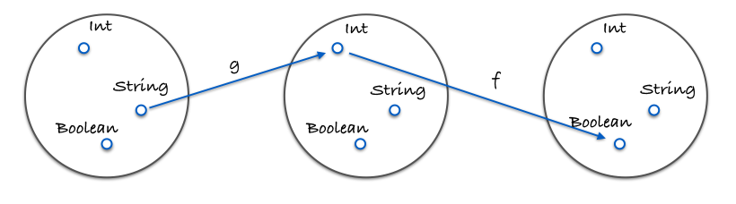

# a guide to functional programming

## 第五章：函数组合（compose）

首先，我们需要了解一下组合的定义，看下面的组合函数 `compose` ：

```js
const compose = (...fns) => (...args) => fns.reduceRight((res, fn) => [fn.call(null, ...res)], args)[0]
```

看起来很复杂吧，这是高级的写法，考虑的是 n 个函数的组合，我们先来看一个简化的版本，仅考虑了两个函数的组合：

```js
const composeTwo = (f, g) => (x) => f(g(x))
```

一旦我们理解了这个方法，我们就可以进一步扩展到其对于任意个函数都适用的情况。

实际上，观察 `composeTwo` 中调用函数的方式，可以发现，组合像是在“饲养”函数：

> 你就是饲养员，选择两个有特点又招你喜欢的函数，让它们结合，并产下一个新的函数

下面提供一个使用函数组合的例子：

[函数组合](./tests/compose.js)

从这个例子中，我们可以知道，函数组合的执行顺序是从右到左，相比于传统的从内到外的写法，这种写法的可读性明显更好，但这并不足以让我们推崇函数组合，而且，为什么一定要是从右向左而不是从左向右呢？要解释这一点，我们需要分析函数组合的特性。

### 1. 函数组合的特性

函数组合中，之所以为从右向左的执行顺序，是因为这样更符合数学上的定义。

这里就需要指出所有函数组合均符合的一个特性了：**结合律**

符合结合律意味着，对于三个需要被组合在一起的函数 f、 g、 h，无论我们先将 f 和 g 组合起来，还是先将 g 和 h 组合起来，都不会影响最终的结果！

```js
compose(f, compose(g, h)) === compose(compose(f, g), h)
```

下面给出一个可变的函数组合的例子：

[可变的函数组合](./tests/variadic.js)

从这个例子中，我们能够感受到符合结合律给我们带来的强大**灵活性**，任意一个函数组合都可以被拆分开来，然后在以另一种方式组合在一起。当然，在进行组合时，我们最好还是关注一下组合的可复用性。

### 2. Pointfree 模式

Pointfree 模式是指，永远无需提及你的数据

> Pointfree 模式中，函数无须提及将要操作的数据是什么样的。一等公民函数、柯里化以及函数组合这三者协作起来，有助于实现 Pointfree 模式

下面给出一个 Pointfree 模式的例子：

[Pointfree](./tests/pointfreeCase.js)

从这个例子中，我们了解到，对于 Pointfree 模式：

* 其能够帮助我们减少不必要的变量命名，保持代码的简洁
* 能够帮助我们检测函数
* 但其也存在一定的问题，并不是所有函数式编程中的函数都需要用 Pointfree 模式！

### 3. 如何调试组合代码？

在使用函数组合的代码中，可能会存在难以追溯bug的问题，所以，我们这里提供一个方法 `trace` ，用于在任何时间观察数据，帮助追寻到bug的所在位置：

```js
const trace = curry((tag, x) => {
    console.log(tag, x)
    return x
})
```

当我们需要观察数据时，只需要将这个方法组合在指定位置即可。

### 4. 为什么要使用函数组合作为构造程序的工具？

函数组合会成为我们在函数式编程中构造程序的工具，其背后是有一个强大的理论做支撑的，下面让我们来了解一下这个理论：**范畴学**

范畴学主要处理的是：

* 对象（Object）
* 态射（morphism）
* 变化式（transformation）

这些概念都是与编程紧密相关的。

在范畴学中，一个【范畴】被定义为这样的一个集合：

* 对象的集合
* 态射的集合
* 态射的组合
* 特殊态射 identity

范畴学可以模拟任何事物，但目前我们仅关心其中的【类型】和【函数】，让我们尝试将范畴学应用到它们身上看看。

#### 4.1 对象的集合

这里讨论的对象实际上指的是**数据类型**，例如：String、Boolean、Number以及Object等。

通常我们会**将数据类型视作所有可能的值的一个集合**，例如：Boolean 类型就是 [true, false] 的集合，Number 则是所有实数的集合。

将类型当作集合对待是有好处的，因为我们可以使用【集合论（set theory）】来处理类型

#### 4.2 态射的集合、态射的组合

这里的态射指的是标准的**纯函数**。

那么实际上，态射的组合指的就是我们前面学到的函数组合 Compose。我们前面提到过，函数组合是符合结合律的，但这并不是巧合，**结合律是在范畴学中对任何组合都适用的一个特性**！

看下面这张图：



函数 `g` 将 String 类型映射到 Integer 类型，函数 `f` 将 Integer 类型映射到 Boolean 类型，即，函数 `g` 的输出类型与函数 `f` 的输入类型一致均为 Integer，所以我们可以将这个两个函数组合起来 `compose(f, g)`，即得到下面这张图：


是不是有点太过抽象了？那么看下面这个例子：

```js
const g = (x) => x.length   // String -> Integer
const f = (x) => x === 4    // Integer -> Boolean

const isFourLetterWord = compose(f, g)
// 将两者组合起来后，isFourLetterWord 实际上就是直接将 String 映射到 Boolean
```

但实际上，范畴并不仅仅包括这些内容，还有许许多多的范畴，但要达到本篇引导的目的，我们只需要关心上面定义的范畴即可。

### 总结

函数组合 Compose 像一系列管道一样，把不同的函数联系在一起，数据在其中流动。

同时，我们认为，组合是高于其它所有原则的设计原则，因为它让我们的代码保持简洁性和可读性。

另外，我们还了解了范畴学，其将在在应用架构、模拟副作用以及保证正确性方面起到作用。

下面是一些练习题：

1. [练习题1](./tests/exercise_a.js)
2. [练习题2](./tests/exercise_b.js)
3. [练习题3](./tests/exercise_c.js)
