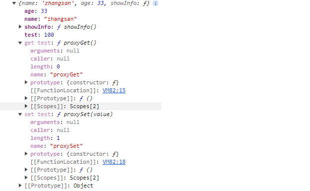

## Vue 数据劫持

### 0. 准备

在了解 Vue 中的数据劫持实现之前，我们可以先用 defineProperty 函数实现一个简单的数据劫持demo，进而帮助我们更好地理解 Vue 中的数据劫持实现。

### 1. 数据代理与数据劫持

数据代理和数据劫持的实现基础在于 defineProperty 函数，在说它之前，我们首先复习两个概念：

1. 箭头函数与普通函数的区别
2. 闭包

#### 1.1 箭头函数与普通函数

对于普通函数，其执行时会形成一条作用域链`[[scopes]]`，函数内部在寻找遍历时，就会顺着这个作用域链进行寻找。

当我们定义一个函数时：

```js
function foo1() {
    console.log('foo1', this)
	// 其中再定义一个函数
    function foo2() {
        console.log('foo2', this)
    }
    return foo2
}
foo1()()
```

当我们执行时，结果如下：


为什么这里 foo2 函数的 `this` 也指向 `window` 呢？

这就需要从作用域链进行分析：

对于 foo1 函数，其定义在全局，当 foo1 执行时，其作用域链中，包含全局作用域，其中包含全局上下文GO，以及其自身的函数作用域，其中包含 foo1 的执行上下文AO1，即此时的作用域链的结构可以简化如下：AO1 → GO。

当 foo1 内部去找`this`时，会顺着作用域链来找，首先到 AO1 中寻找，无法找到`this`变量，所以会去上层作用域中寻找，而GO身上恰好有`this`变量，且该`this`指向`window`对象，所以 foo1 内部的`this`指向`window`。

而对于 foo2 函数，当其执行时，同样会创建一个函数作用域，其中包含有 foo2 的执行上下文AO2，并将该作用域挂载到当前作用域链的顶部，所以，此时的作用域链结构可以简化如下：AO2 → AO1 → GO。与 foo1 同理，顺着作用域链找，只有 GO 身上有`this`，所以 foo2 中的`this`也指向`window`。

根据如上分析，我们会发现，在普通函数内部，我们是可以改变`this`指向的：

```js
// 可以通过对象调用的方式来改变this指向(这里还是用上面的foo1函数作为例子)
let obj = {name: 'obj改变this指向', print: foo1};
obj.print()

// 也可以借助 call apply 方法改变this指向
foo1.call({name: 'call方法改变this指向'})
```

执行结果如下：


另外，在 AO 对象中实际上还保存了函数的实参，可以通过 arguments 来访问，这里就不举例了。

但是，箭头函数并不符合以上的结论。在箭头函数中，我们无法改变this的指向，其内部的this只能顺着作用域链进行寻找，即箭头函数的执行上下文中没有this，这也就是为什么我们常说，**箭头函数的this指向就是其上层作用域的this指向**。

#### 1.1 闭包

实际上，之所以能够形成闭包，就是因为作用域链的存在：

```js
function foo() {
    var a = 2;
    
    // 函数bar()的词法作用域能够访问foo()的内部作用域，即bar函数中能够访问foo函数作用域中的变量。
    function bar() {
        console.log( a );
    }
    return bar;
}

var baz = foo();
baz();
```

以上代码中，在 foo() 执行后，通常会觉得 foo() 的整个内部作用域应该都被销毁，因为JS引擎有垃圾回收器用来释放不再使用的内存空间。且看上去 foo() 的内容不会再被使用，所以很自然地会考虑对其进行回收。

而由于闭包的存在，导致事实上内部作用域依然存在，因此没有被回收。

那么谁在使用这个内部作用域？是 bar() 本身在使用。

拜 bar() 所声明的位置所赐，它拥有涵盖 foo() 内部作用域的闭包，使得该作用域能够一直存活，以供 bar() 在之后任何时间进行引用。**即 bar() 依然持有对该作用域的引用，而这个引用就叫作闭包**

闭包有很多应用场景，这里只说其中最常用的一个：**封装私有变量**，这一应用场景在后面的介绍中也会提到。

#### 1.3 defineProperty

完成以上内容的复习后，我们就可以了解 defineProperty 方法了。

defineProperty 方法有什么用？

> **`Object.defineProperty()`** 静态方法会直接在一个对象上定义一个新属性，或修改其现有属性，并返回此对象。

即我们除了在定义对象时为其加属性，还可以在定义后，通过 defineProperty 方法为其添加属性：

```js
// 在定义时就加上属性
let obj = {
    name: 'test',
    age: 18,
}

// 通过 defineProperty 为其添加属性
Object.defineProperty(obj, 'ccc', {
    value: 10,
    enumerable: true,  // 是否能枚举
    configurable: true, // 是否能删除
    writable: true  // 是否能写入
})
// 枚举
var keys = Object.keys(obj);
console.log(keys);
// 写入
obj.ccc = 100;
console.log(obj);
// 删除
delete obj.ccc;
console.log(obj);
```

defineProperty 方法有三个参数：

1. obj --- 要定义属性的对象
2. prop --- 要定义或修改的属性key
3. descriptor --- 属性的描述符

前两个好理解，关键是最后一项 descriptor，MDN文档中的描述是：

> 对象中存在的属性描述符有两种主要类型：数据描述符和访问器描述符。**数据描述符**是一个具有可写或不可写值的属性。**访问器描述符**是由 getter/setter 函数对描述的属性。描述符只能是这两种类型之一，不能同时为两者。

数据描述符和访问器描述符都是**对象**。它们共享以下可选键：

* `configurable`

   当设置为 `false` 时，该属性的类型不能在数据属性和访问器属性之间更改，且该属性**不可被删除**，且其描述符的其他属性也不能被更改（但是，如果它是一个可写的数据描述符，则 `value` 可以被更改，`writable` 可以更改为 `false`）。**默认值为 `false`。**

* `enumerable`

   值为 `true` 时，该属性可被枚举。**默认值为 `false`。**

对于**数据描述符**，其还有以下两个可选键：

* `value`

   与属性相关联的值。可以是任何有效的 JavaScript 值（数字、对象、函数等）。**默认值为 `undefined`。**

* `writable`

   为 `true` 时，该属性可以被赋值运算符更改。**默认值为 `false`。**

对于访问器描述符，MDN文档中对于其可选键的描述为：

> [`get`](https://developer.mozilla.org/zh-CN/docs/Web/JavaScript/Reference/Global_Objects/Object/defineProperty#get)
>
> 用作属性 getter 的函数，如果没有 getter 则为 [`undefined`](https://developer.mozilla.org/zh-CN/docs/Web/JavaScript/Reference/Global_Objects/undefined)。当访问该属性时，将不带参地调用此函数，并将 `this` 设置为通过该属性访问的对象（因为可能存在继承关系，这可能不是定义该属性的对象）。返回值将被用作该属性的值。**默认值为 [`undefined`](https://developer.mozilla.org/zh-CN/docs/Web/JavaScript/Reference/Global_Objects/undefined)。**
>
> [`set`](https://developer.mozilla.org/zh-CN/docs/Web/JavaScript/Reference/Global_Objects/Object/defineProperty#set)
>
> 用作属性 setter 的函数，如果没有 setter 则为 [`undefined`](https://developer.mozilla.org/zh-CN/docs/Web/JavaScript/Reference/Global_Objects/undefined)。当该属性被赋值时，将调用此函数，并带有一个参数（要赋给该属性的值），并将 `this` 设置为通过该属性分配的对象。**默认值为 [`undefined`](https://developer.mozilla.org/zh-CN/docs/Web/JavaScript/Reference/Global_Objects/undefined)。**

当 descriptor 没有 `value`、`writable`、`get` 和 `set` 键中的任何一个，它将被视为数据描述符！

这里为前面的 obj 对象定义一对 getter 和 setter 属性，然后再将其打印出来，看看它的结构：

```js
Object.defineProperty(obj, 'test', {
    // value: 10,
    enumerable: true,  // 是否能枚举
    configurable: true, // 是否能删除
    // writable: true,  // 是否能写入
    get: function proxyGet() {
        return test;
    },
    set: function proxySet(value) {
        test = value;
    }
})
console.log(obj.test);
obj.test = 100;
console.log(obj.test);

console.log(obj);
```

打印结果如下：



可以看到对象身上拥有一对 getter 和 setter，此时我们对 obj 的 test 属性进行读写的时候，就会通过 getter 和 setter 来实现了！

而 getter 和 setter 实际上就是数据代理和数据劫持的实现关键。

所以，我们实际上就有了对 Vue 中数据劫持的简单理解：**通过 defineProperty 为每一数据定义其对应的 getter 和 setter，通过 getter 和 setter 拦截对该数据的读写操作，然后进行一些额外的操作或直接修改返回的结果**。

当然 Vue 的具体实现要比这个复杂的多，下面对其实现方式进行介绍。

### 2. Vue 数据劫持

#### 2.1 利用 defineProperty 实现对象某一属性的数据劫持

根据上面对于 defineProperty 方法的介绍，我们实际上就已经知道了，可以通过该方法来实现对数据的劫持，而 Vue 中正是这样做的。

但 Vue 中并不是单纯地使用 defineProperty，因为如果我们需要同时监控某个对象的多个属性时，可能需要定义多个不同的 val 变量，所以 Vue 中选择将 defineProperty 方法进行一层封装，利用前面我们提到的**闭包**的特性，将 val 进行私有变量的封装，使得我们无需在全局作用域中进行暴露即可供 getter、setter 使用。

在定义响应式数据时，Vue 会对该数据的所有下层属性都执行 `defineReactive` 方法，defineReactive 方法可以简化如下：

```js
function defineReactive(obj, key, val) {
    ...
    // 为当前属性添加 getter、setter
    Object.defineProperty(obj, key, {
        enumerable: true,
        configurable: true,
        get: function reactiveGetter() {
            //收集依赖
            return val
        },
        set: function reactiveSetter(newValue) {
            //触发依赖
            val = newValue
        },
    });
}

const data = {}
defineReactive(data, 'demo', 0)
```

可以看到，`defineReactive` 方法做了以下工作：

为当前数据定义 getter、setter，实现对该属性的劫持。同时，在 getter 中，收集该数据的依赖；在 setter 中，触发该数据的所有依赖。

#### 2.2 数组的数据劫持

那么对于数组类型的数据，Vue 如何实现对其的劫持呢？

Vue 选择对数组数据的**某些实例方法**进行劫持，当使用这些被劫持的方法操作数组时，就会触发该数组数据的依赖。Vue 中劫持的数组方法有：`push`、`pop`、`shift`、`unshift`、`splice`、`sort`、`reverse`

#### 2.3 利用 Observer 类来劫持对象的嵌套属性

前面提到过，使用 Vue 封装过后的 `defineReactive` 方法，我们可以实现对象以及对象的某一属性的数据劫持，但是对于对象中的嵌套属性，如果我们手动地位每一个属性都调用一次该方法，显然太过于麻烦了。

所以，Vue 中进行了进一步的封装，即 **Observer** 类，用于实现在仅提供一个对象时，即可完成对其下所有属性的数据劫持。

简化后的 Observer 类如下：

```js
export class Observer {
  constructor (value) {
      ...
      def(value, '__ob__', this)
      this.walk(value)
  }

  walk (obj) {
    const keys = Object.keys(obj)
    for (let i = 0; i < keys.length; i++) {
      defineReactive(obj, keys[i])
    }
  }
}
```

Observer 类构造函数接收一个 value，即要实现劫持的对象。

这里的 `def` 方法实际上也是对 defineProperty 方法的封装：

```js
/**
 * Define a property.
 */
function def (obj, key, val, enumerable) {
  Object.defineProperty(obj, key, {
    value: val,
    enumerable: !!enumerable,
    writable: true,
    configurable: true
  });
}
```

这里使用 def 方法将当前 Observer 实例以 `__ob__` 名称添加到当前正在处理的对象身上(当然，此时也可能是我们一开始传入的某个对象的某个属性)。其目的是为了防止对某个属性的重复劫持，当对象身上已经有 `__ob__` 属性，说明该对象已经被劫持过了。

接下来，调用 `walk` 方法，遍历对象的每一属性，为其每一属性都执行一次 defineProperty 方法，从而实现对对象以及其嵌套属性的数据劫持。

同时，Vue 中为了方便使用，还封装了一个 `observer` 的辅助函数：

```js
function observer (value) {
    if (!isObject(value)) {
        return
    }
    var ob;
    if (hasOwn(value, '__ob__') && value.__ob__ instanceof Observer) {
        ob = value.__ob__;
    } else {
        ob = new Observer(value);
    }
    return ob
}
```

实际上就是，如果目标对象(同样，此时也可能是我们一开始传入的某个对象的某个属性)已经被劫持，即已经有 `__ob__` 属性，则直接返回该对象保存的 Observer 实例对象。如果没有被劫持，则调用 Observer 构造函数触发 walk 成员方法来对目标对象的下一层属性进行数据劫持。

但是，结合上面的 Observer 类的实现进行分析，调用 observer 方法后，最多只会创建一个 Observer 类对象，但 walk 方法中仅能对 value 对象的下一层属性进行遍历，而无法触及到更深层的属性。

所以，我们需要递归地调用 observer 方法，这里，Vue 将递归调用放在了 defineProperty 方法中，所以，这里我们能够把前面的 defineProperty 实现进行补全：

```js
function defineReactive(obj, key, val = obj[key]) {
    // 对当前属性的下一层属性进行劫持
    let childOb = observe(val)
    // 为当前属性添加 getter、setter
    Object.defineProperty(obj, key, {
        enumerable: true,
        configurable: true,
        get: function reactiveGetter() {
            //收集依赖
            return val
        },
        set: function reactiveSetter(newValue) {
            //触发依赖
            val = newValue
        },
    });
}
```

当然，这里的递归并不是常规意义上的递归，这里的整套递归流程是跨越了多个函数的：


注意，在 observer 方法中，只有当该值为**对象类型**时才会继续走下去，否则直接跳出递归。

对某一对象调用 `observer` 方法是这一整套递归的开始：

1. 调用 observer(obj)，判断该变量是否对象类型、是否已经被劫持过，若是对象类型且没有被劫持过，则为其创建一个 Observer 实例，并将其作为 `__ob__` 属性挂载到当前对象身上。
2. 接下来，调用 walk 方法，遍历该对象的所有下一层属性，并为每一下层属性调用 defineProperty 方法，实现该属性的劫持。
3. 在 defineProperty 方法中，对当前属性调用一次 observer 方法，若该子属性也满足对象类型且没有被劫持过的条件，则递归地对其下层属性进行劫持
4. 完成下层属性的劫持后，递归完成，继续上一层子属性的劫持

最终，实现对目标对象以及其所有层级的嵌套属性数据劫持。

下面把上述代码总结一下：

```js
// 数据劫持
function defineReactive(data, key, value = data[key]) {
  const dep = new Dep()
  // 对当前属性的下一层属性进行劫持
  let childOb = observe(val)
  // 对当前属性进行拦截
  Object.defineProperty(data, key, {
    get: function reactiveGetter() {
      // 收集依赖...
      return value
    },
    set: function reactiveSetter(newValue) {
      if (newValue === value) return
      value = newValue
      // 触发依赖
    }
  })
}

// observer 方法
function observer (value) {
    if (!isObject(value)) {
        return
    }
    var ob;
    if (hasOwn(value, '__ob__') && value.__ob__ instanceof Observer) {
        ob = value.__ob__;
    } else {
        ob = new Observer(value);
    }
    return ob
}

// Observer 类
export class Observer {
  constructor (value) {
      ...
      def(value, '__ob__', this)
      this.walk(value)
  }
  // 遍历下一层属性，执行defineReactive
  walk (obj) {
    const keys = Object.keys(obj)
    for (let i = 0; i < keys.length; i++) {
      defineReactive(obj, keys[i])
    }
  }
}

// def 方法，用于为当前正在拦截的数据添加 __ob__ 属性
function def (obj, key, val, enumerable) {
  Object.defineProperty(obj, key, {
    value: val,
    enumerable: !!enumerable,
    writable: true,
    configurable: true
  });
}
```

以上，就是 Vue 中实现数据劫持的过程，但要实现响应式，仅仅实现数据劫持还不够，我们现在仅仅能够捕捉到对数据的访问和修改，还需要对此做出相应的处理，即**收集依赖**和**触发依赖**。

