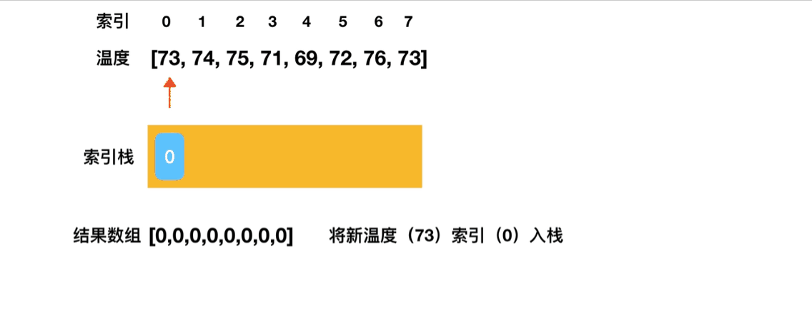

# 栈与队列 part1

## 1.典型真题快速上手 --- “有效括号”问题

```cmd
题目描述：给定一个只包括 '('，')'，'{'，'}'，'['，']' 的字符串，判断字符串是否有效。

有效字符串需满足： 左括号必须用相同类型的右括号闭合。
左括号必须以正确的顺序闭合。
注意空字符串可被认为是有效字符串。

示例 1:
输入: "()"
输出: true

示例 2:
输入: "()[]{}"
输出: true

示例 3:
输入: "(]"
输出: false
```

### 1.1 💡思路分析

括号问题在面试中出现频率非常高， 这类题目我们一般首选用**栈**来做。

为什么？因为一对括号的对称性和栈中一组数据入栈和出栈顺序的对称性是十分契合的。比如说1、2、3、4、5、6按顺序入栈，其对应的出栈序列就是 6、5、4、3、2、1。

❗Tips：当题目中涉及括号问题，则很可能与栈有关

所以这道题的思路就很简单了，我们遍历字符串时：

* 遇到左括号，则将其压入栈中；
* 遇到右括号，则将其与栈顶的符号进行匹配，若有效，则将对应左括号出栈；否则说明字符串中存在非有效括号；此外，如果遇到右括号时，栈为空，也说明存在非有效括号。

### 1.2 编码实现

```js
// 用一个 map 来维护左括号和右括号的对应关系
const leftToRight = {
  "(": ")",
  "[": "]",
  "{": "}"
};

/**
 * @param {string} s
 * @return {boolean}
 */
const isValid = function(s) {
  // 1. 字符串为空时直接判断为有效
  if (!s.length && !s) {
    return true;
  }

  // 2. 准备栈
  const stack = [];

  // 3. 遍历字符串
  for (let i = 0; i < s.length; i++) {
    let ch = s[i];
    
    if (ch === '(' || ch === '{' || ch === '[') {
      // 如果遇到左括号，压入栈中
      stack.push(ch);
    } else {
      // 如果遇到右括号，与栈顶符号进行匹配
      if (ch !== leftToRight[stack.pop()] || !stack.length) {
        return false;
      }
    }
  }

  // 4. 遍历完成后，若字符串有效，栈应该是空的
  return !stack.length;
}
```

## 2. 栈问题进阶 --- 每日温度问题

```cmd
题目描述: 根据每日气温列表，请重新生成一个列表，对应位置的输出是需要再等待多久温度才会升高超过该日的天数。如果之后都不会升高，请在该位置用 0 来代替。

例如，给定一个列表 temperatures = [73, 74, 75, 71, 69, 72, 76, 73]，你的输出应该是 [1, 1, 4, 2, 1, 1, 0, 0]。

提示：气温 列表长度的范围是 [1, 30000]。每个气温的值的均为华氏度，都是在 [30, 100] 范围内的整数。
```

### 2.1 💡思路分析

看到这道题，大家不难想到暴力遍历法：直接两层遍历，第一层定位一个温度，第二层定位离这个温度最近的一次升温是哪天，然后求出两个温度对应索引的差值即可。

一个数组两层遍历，属于比较少见且高危的操作，此时我们就需要反思：这道题是不是压根不该用暴力遍历来做？

答案是肯定的。因为在这个暴力遍历的过程中，我们其实做了很多“多余”的事情。

拿第三个索引位上这个 75 来说，我们在定位比 75 高的第一个温度的过程中，就路过了 71、69、72 这三个温度，其中，72 正是 71 对应的目标温度，可我们却像没看见它一样、啥也没干。只有等最外层遍历走到 71 时，我们才又重复了一遍刚刚走过的路、确认了 71 和 72 之间的关系——像这种不必要的重复，我们要想办法把它干掉。

**栈结构可以帮我们避免重复操作。**

避免重复操作的秘诀就是**及时地将不必要的数据出栈**，避免它对我们后续的遍历产生干扰。

拿这道题来说，我们的思路就是：**尝试去维持一个递减栈**。

首先我们遍历每日气温数组，准备将每日的气温以及其在数组中的下标作为 target 一起入栈：

* 若栈中没有数据，则直接入栈；
* 若栈中有数据，则将 target 与当前栈顶元素进行比较，若 target 的气温低于当前栈顶元素，则入栈并继续遍历；若 target 的气温高于当前栈顶元素，则将当前栈顶元素出栈，并将其对应的结果置为 target 与当前栈顶元素的下标差值，然后，重复这一步骤，直到 target 的气温低于栈顶元素的气温，再将 target 入栈。



遍历完成后，将栈中所有剩余元素的结果都设置为 0。

### 2.2 编码实现

```js
/**
 * @param {number[]} T
 * @return {number[]}
 */
// 入参是温度数组
const dailyTemperatures = function (T) {
  // 1. 准备栈和结果数组
  let stack = [];
  let res = T;

  // 2. 遍历温度数组
  for (let i = 0; i < T.length; i++) {
    // 当栈不为空，且温度不满足递减时
    while(!stack.length && T[i] > T[stack[stack.length - 1]]) {
      // 将当前栈顶元素出栈
      let top = stack.pop();
      // 将其对应结果置为下标差值
      res[top] = i - top;
    }
    // 将当前温度入栈
    stack.push(i);
  }

  return res;
};
```

## 3. 栈的设计 --- “最小栈”问题

```cmd
题目描述：设计一个支持 push ，pop ，top 操作，并能在常数时间内检索到最小元素的栈。

push(x) —— 将元素 x 推入栈中。
pop() —— 删除栈顶的元素。
top() —— 获取栈顶元素。
getMin() —— 检索栈中的最小元素。

示例:
MinStack minStack = new MinStack();
minStack.push(-2);
minStack.push(0);
minStack.push(-3);
minStack.getMin(); --> 返回 -3.
minStack.pop();
minStack.top(); --> 返回 0.
minStack.getMin(); --> 返回 -2.
```

### 3.1 💡思路分析

这道题并不难，但是综合性很强，整个题做下来能够相对全面地考察到候选人对栈结构、栈操作的理解和掌握。

其中前三个操作：`push`、`pop` 和 `top`，我们在数据结构快速上手环节已经给大家讲过了，这里不多赘述。需要展开讲的是 `getMin` 这个接口，这个接口有时候会直接单独拎出来作为一道题来考察，需要大家对它的实现思路有一个真正扎实的掌握。

getMin 要做的事情，是从一个栈里找出其中最小的数字。我们仍然是抛砖引玉，先说一个大部分人都能想到的思路：

初始化一个最小值变量，它的初始值可以设一个非常大的数（比如 `Infinity`），然后开始遍历整个栈。在遍历的过程中，**如果遇到了更小的值，就把最小值变量更新为这个更小的值**。这样遍历结束后，我们就能拿到栈中的最小值了。

这个过程中，我们对栈进行了一次遍历，时间复杂度无疑是 O(n)。

按照这个思路，整个栈的设计我们可以这样写：

### 3.2 编码实现1

```js
/**
 * 初始化你的栈结构
 */
const MinStack = function () {
  this.stack = [];
};

/**
 * @param {number} x
 * @return {void}
 */
// 栈的入栈操作，其实就是数组的 push 方法
MinStack.prototype.push = function (x) {
  this.stack.push(x);
};

/**
 * @return {void}
 */
// 栈的入栈操作，其实就是数组的 pop 方法
MinStack.prototype.pop = function () {
  this.stack.pop();
};

/**
 * @return {number}
 */
// 取栈顶元素，咱们教过的哈，这里我本能地给它一个边界条件判断
MinStack.prototype.top = function () {
  if (!this.stack || !this.stack.length) {
    return;
  }
  return this.stack[this.stack.length - 1];
};

/**
 * @return {number}
 */
// 按照一次遍历的思路取最小值
MinStack.prototype.getMin = function () {
  let minValue = Infinity;
  const { stack } = this;
  for (let i = 0; i < stack.length; i++) {
    if (stack[i] < minValue) {
      minValue = stack[i];
    }
  }
  return minValue;
};
```

这样写，用例也能跑通，但是不够高效。那么有没有更高效的做法？

时间效率的提升，从来都不是白嫖，它意味着我们**要付出更多的空间占用作为代价**。在这道题里，如果继续沿着栈的思路往下走，我们可以考虑再搞个栈（stack2）出来作为辅助，让这个栈去容纳当前的最小值。

如何确保 stack2 能够确切地给我们提供最小值？ 这里我们需要实现的是一个 `从栈底到栈顶呈递减趋势的栈`，那么我们就需要重新考虑前面的 `push`、`pop` 操作：

* 若有新元素入栈：判断是不是比 stack2 栈顶元素还要小，否则不准进入 stack2。
* 若有元素出栈：判断是不是和 stack2 栈顶元素相等，如果是的话，stack2 也要出栈。

至于 `getMin` 操作，既然我们维护了一个递减的栈，那么直接取其栈顶元素即可。按照这个思路，我们可以有以下编码：

### 3.3 编码实现2

```js
/**
 * 初始化你的栈结构
 */
const MinStack = function () {
  // 定义存储栈
  this.stack1 = [];
  // 定义辅助栈
  this.stack2 = [];
};

/**
 * @param {number} x
 * @return {void}
 */
// 栈的入栈操作
MinStack.prototype.push = function (x) {
  this.stack1.push(x);
  // 对于辅助栈，需要将 x 与 stack2 栈顶元素进行比较，确保 stack2 的递减
  if (x <= this.stack2[this.stack2.length - 1]) {
    this.stack2.push(x);
  }
};

/**
 * @return {void}
 */
// 栈的入栈操作
MinStack.prototype.pop = function () {
  let top = this.stack1.pop();
  // 对于辅助栈，如果当前出栈元素与栈顶元素相等，则将其出栈
  if (top === this.stack2[this.stack2.length - 1]) {
    this.stack2.pop();
  }
  return top;
};

/**
 * @return {number}
 */
// 取栈顶元素，咱们教过的哈，这里我本能地给它一个边界条件判断
MinStack.prototype.top = function () {
  if (!this.stack1 || !this.stack1.length) {
    return;
  }
  return this.stack1[this.stack1.length - 1];
};

/**
 * @return {number}
 */
// 直接取辅助栈 stack2 的栈顶元素即可
MinStack.prototype.getMin = function () {
  return this.stack2[this.stack2.length - 1];
};
```
